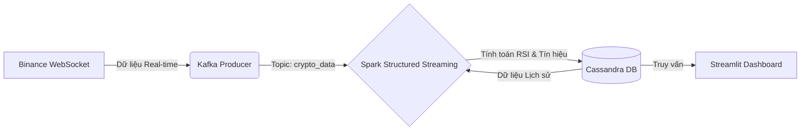

# 🚀 Hệ thống Tư vấn Giao dịch Crypto Đa luồng Thời gian thực (Real-time Multi-Crypto Trading Advisor)

Hệ thống tư vấn giao dịch tần suất cao (High-Frequency Trading) được xây dựng dựa trên nền tảng các công nghệ **Big Data**. Hệ thống thu thập dữ liệu giá tiền điện tử theo thời gian thực từ Binance, xử lý luồng bằng Apache Spark và cung cấp tín hiệu Mua/Bán dựa trên chiến thuật RSI thông qua Dashboard tương tác.


## 📊 Kiến trúc Hệ thống

Hệ thống tuân theo mô hình xử lý dòng dữ liệu thời gian thực (Real-time Stream Processing):


**Luồng dữ liệu (Data Flow):**
1.  **Thu thập (Ingestion):** Kết nối trực tiếp tới **Binance Stream** (WebSocket) để nhận giá khớp lệnh (tick) của `BTC`, `ETH`, `BNB` ngay lập tức.
2.  **Vùng đệm (Buffering):** Đẩy dữ liệu thô vào **Apache Kafka** để đảm bảo khả năng chịu tải cao và không mất mát dữ liệu.
3.  **Xử lý (Processing):** **Apache Spark** đọc dữ liệu từ Kafka, kết hợp với dữ liệu lịch sử từ **Cassandra**, tính toán chỉ số RSI và sinh ra tín hiệu (MUA/BÁN/GIỮ).
4.  **Lưu trữ (Storage):** Dữ liệu đã xử lý và tín hiệu được ghi xuống **Apache Cassandra** (NoSQL) để tối ưu tốc độ ghi.
5.  **Hiển thị (Visualization):** **Streamlit** liên tục truy vấn database và cập nhật biểu đồ, thẻ tín hiệu lên giao diện người dùng.
---
## 🛠 Công nghệ sử dụng (Tech Stack)

| Thành phần | Công nghệ | Mô tả |
|-----------|----------|------|
| **Nguồn dữ liệu** | Binance API | Sử dụng WebSocket (WSS) để lấy dữ liệu giao dịch realtime. |
| **Hàng đợi thông điệp** | Apache Kafka | Phân tách giữa bên gửi và bên nhận, đảm bảo an toàn dữ liệu. |
| **Xử lý luồng** | PySpark (Spark Streaming) | Thực hiện tính toán trên cửa sổ trượt *(Windowed calculations)* và logic RSI. |
| **Cơ sở dữ liệu** | Apache Cassandra | Database phân tán NoSQL tối ưu cho dữ liệu chuỗi thời gian. |
| **Giao diện** | Streamlit & Altair | Web App tương tác dành cho người dùng cuối *(Trader)*. |
| **Hạ tầng** | Docker & Docker Compose | Đóng gói môi trường, triển khai nhanh chóng chỉ với 1 lệnh. |
---
⚡ **Tính năng nổi bật**

- Hỗ trợ Đa Coin (Multi-Coin): Theo dõi đồng thời 3 cặp tiền lớn nhất: BTC/USDT, ETH/USDT, và BNB/USDT.

- Xử lý thời gian thực: Độ trễ từ sàn Binance đến màn hình Dashboard chỉ dưới 2 giây.

- Chiến thuật thông minh (RSI Strategy):
  - 🟢 **MUA (BUY)**: Khi RSI < 30 (Vùng quá bán – Giá có thể hồi phục).
  - 🔴 **BÁN (SELL)**: Khi RSI > 70 (Vùng quá mua – Giá có thể giảm).
  - 🟡 **GIỮ (HOLD)**: Khi thị trường đi ngang hoặc chưa rõ xu hướng.

- Giao diện chuyên nghiệp: Chế độ hiển thị trực quan, biểu đồ có đánh dấu điểm mua/bán, thể tín hiệu đổi màu theo trạng thái.

- Khả năng chịu lỗi: Xây dựng trên kiến trúc phân tán (Spark/Kafka/Cassandra), có thể mở rộng dễ dàng.
---
## 🚀 Hướng dẫn Cài đặt & Triển khai

### Yêu cầu tiên quyết
- Đã cài đặt Docker & Docker Compose.
- Đã cài đặt Python 3.8 trở lên.

### 1. Khởi tạo Hạ tầng (Docker)
Chạy lệnh sau để bật các dịch vụ (Zookeeper, Kafka, Spark, Cassandra):

```bash
docker-compose up -d
```
### 2. Khởi tạo Cơ sở dữ liệu
Tạo Keyspace và Bảng (Table) trong Cassandra:
```bash
docker exec -it cassandra cqlsh -e "
  CREATE KEYSPACE IF NOT EXISTS crypto_db WITH replication = {'class': 'SimpleStrategy', 'replication_factor': 1};
  CREATE TABLE IF NOT EXISTS crypto_db.market_data (
    symbol text, 
    timestamp timestamp, 
    price double, 
    signal text, 
    PRIMARY KEY (symbol, timestamp)
  );"
```
### 3. Cài đặt thư viện Python
```bash
pip install kafka-python pyspark==3.5.0 cassandra-driver streamlit pandas altair websocket-client
```
---
## ▶️ Hướng dẫn Chạy hệ thống
Bạn cần mở 3 cửa sổ Terminal riêng biệt để chạy các thành phần của pipeline:

Terminal 1: Data Producer (Thu thập dữ liệu từ Binance)
```bash
python3 producer.py
```
Terminal 2: Spark Processor (Bộ não xử lý & Sinh tín hiệu)
```bash
python3 processor.py
```
Terminal 3: User Dashboard (Giao diện Web)
```bash
python3 -m streamlit run dashboard.py
```
👉 Truy cập Dashboard tại địa chỉ: http://localhost:8501
---
## 📂 Cấu trúc Dự án
```bash
├── producer.py         # Kết nối Binance WebSocket & Đẩy dữ liệu vào Kafka
├── processor.py        # Logic Spark Streaming (Thuật toán RSI & Đa luồng)
├── dashboard.py        # Giao diện người dùng (Streamlit UI)
├── docker-compose.yml  # Định nghĩa hạ tầng hệ thống
└── README.md           # Tài liệu hướng dẫn
```
---
## 🧠 Logic Nghiệp vụ (Chiến thuật RSI)

Hệ thống cài đặt thuật toán **Relative Strength Index (RSI)** với cơ chế của sổ trượt:

1. Spark truy vấn 30 điểm dữ liệu gần nhất từ Cassandra để tạo ngữ cảnh lịch sử.

2. Kết hợp với dữ liệu mới nhận từ Kafka để tính điểm RSI (thang 0-100).

3. Quy tắc ra quyết định:
   - Nếu **RSI > 70**: Tín hiệu **BÁN** (Khả năng đảo chiều giảm).
   - Nếu **RSI < 30**: Tín hiệu **MUA** (Khả năng đảo chiều tăng).
   - Còn lại: Tín hiệu **GIỮ**.

💬 **Miễn trừ trách nhiệm (Disclaimer)**

Dự án này được xây dựng nhằm mục đích học tập và nghiên cứu (Đồ án môn học Big Data).

Các tín hiệu giao dịch được tạo ra dựa trên thuật toán kỹ thuật cơ bản và **không được coi là lời khuyên tài chính** cho việc đầu tư thực tế.
